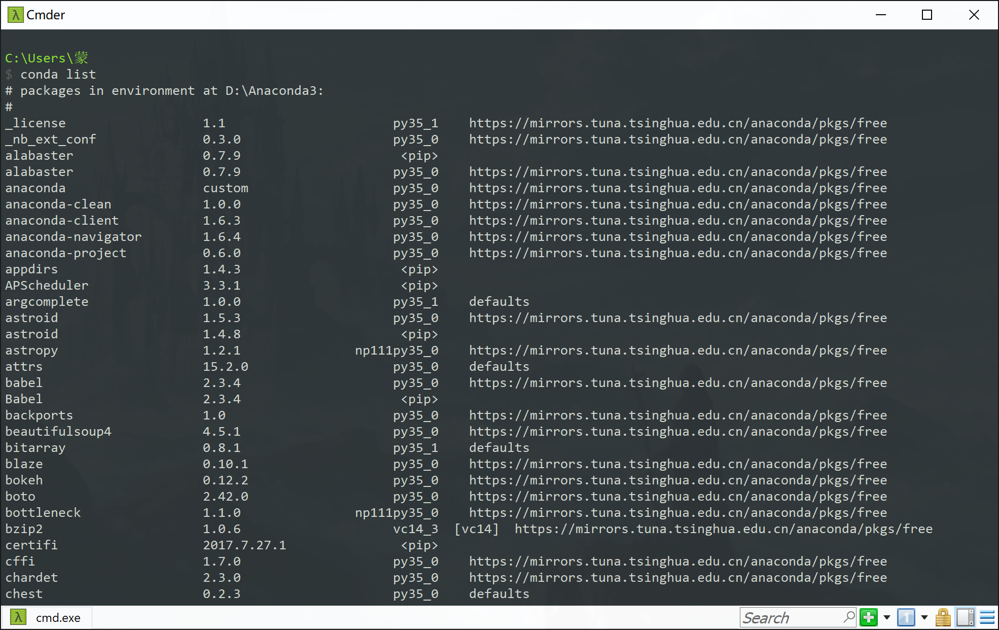

# python语言与计算机科学
### 课程设置
1. 计算机基础知识
2. python（3.x)基本语法

1. python常用内建库（math, sys, os, re...），常用第三方库（numpy, matplotlib, scipy...)
2. 网络爬虫原理与常用框架（scrapy）
3. 科学计算实例
4. 体系结构简述：CPU与GPU
5. 基于CUDA的高性能计算（HPC on GPU）
6. 机器学习基本方法（还没想好怎么讲XD）

### 注意事项
* 最好带电脑
* 不需要什么基础
* 课程中使用的**python版本为python 3.5**

### 运行环境的配置
1. 下载**Anaconda3 4.2.0**的安装包
    * [win（64位）](https://repo.continuum.io/archive/Anaconda3-4.2.0-Windows-x86_64.exe)
    * [win（32位）](https://repo.continuum.io/archive/Anaconda3-4.2.0-Windows-x86.exe)
    * [mac（64位）](https://repo.continuum.io/archive/Anaconda3-4.2.0-MacOSX-x86_64.sh)

2. 安装结束后打开cmd（win+R运行cmd），输入```conda list```，若出现下图结果，说明安装成功：

3. 如果配置出了什么问题，请邮件联系朱政同学长：<zhuzht15@lzu.edu.cn>

4. 推荐大家使用的IDE是Anaconda自带的**Spyder**

    或者自行下载**PyCharm**, [点我下载](https://www.jetbrains.com/pycharm/download/#section=windows)
